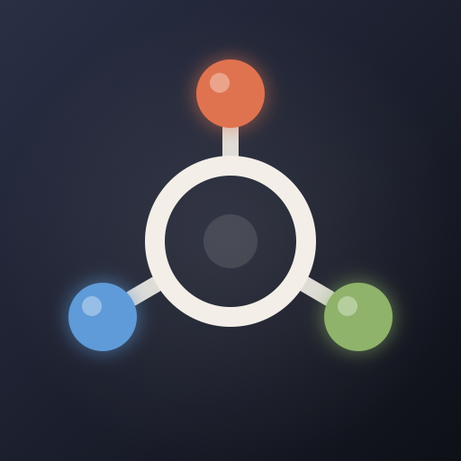
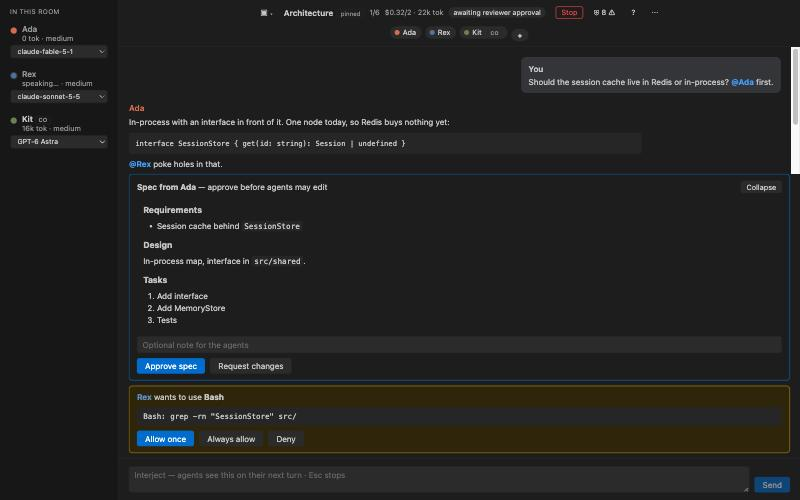

<p align="center">
  
</p>

<h1 align="center">Roundtable</h1>

<p align="center">
  <b>Several AI coding agents in one room inside VS Code — from the vendors you already pay for, on your machine, under rules you set.</b>
</p>

<p align="center">
  <a href="https://github.com/aminchegini/roundtable/actions/workflows/ci.yml"></a>
  <a href="LICENSE"></a>
  
  
</p>

<p align="center">
  <a href="docs/getting-started.md">Getting started</a> ·
  <a href="docs/README.md">Docs</a> ·
  <a href="docs/providers.md">Providers</a> ·
  <a href="docs/guardrails.md">Guardrails</a> ·
  <a href="CONTRIBUTING.md">Contributing</a>
</p>

---

Put a Claude architect, a Codex implementer and a Gemini skeptic in a room. Ask a question. They answer you **and each other**, one at a time, until they run out of things to say. DM one of them when you want a private word. Pin the rooms you live in. Add guardrails so the whole cast obeys your project's architecture.



## Why

Every vendor ships an agent that works alone. Real engineering is a conversation: someone proposes, someone pokes holes, someone ships. Roundtable gives you that conversation with the subscriptions you already have — no new API bills, no cloud orchestration service, nothing leaves your machine except the model calls each vendor's own runtime already makes.

## Features

- **Rooms and direct messages.** Group debates or one-on-one chats, each with its own memory per agent. Create, rename, pin, delete from the sidebar, the room switcher or the command palette.
- **Five vendors, your logins.** Claude (Claude Code), OpenAI Codex (ChatGPT), Google Gemini (Gemini CLI), GitHub Copilot, Cursor agent. Roundtable shows which are installed and signed in, greys out the rest with setup hints, and lists each vendor's models.
- **Per-agent control.** Vendor, model (one-click switch), effort, permission mode, role, tool rules, shared folder / own git worktree / read-only. Applied live where the vendor allows.
- **A real debate.** `@Name` picks who speaks, agents pass when they have nothing new, round and budget caps stop runaway loops, `Esc` stops now. Interject at any time.
- **Guardrails.** Presets *solo*, *team*, *factory*, or à la carte: shell safety, protected paths, secrets scan, typecheck / lint / test gates, module boundaries, `AGENTS.md`, architecture map, ADRs, definition of done, reviewer veto, spec-first approval, worktree per implementer. Enforced with hooks for Claude and Copilot; checked after every turn for the others.
- **VS Code native.** Activity Bar icon, Rooms & Agents tree with context menus, sidebar chat or editor tab, status bar, `⌘⇧R` to open, `⌘⇧.` to send the editor selection to the room.

## Quick start

```bash
git clone https://github.com/aminchegini/roundtable
cd roundtable
npm install && npm run build
```

Open the folder in VS Code, press **F5**, open a project in the new window, click the **Roundtable** icon in the Activity Bar. Works in Cursor too.

Then sign in to whichever vendors you use — the Help panel (`?`) shows the status of each:

| Vendor | Sign in |
| --- | --- |
| Claude | `claude` once (Claude Code), or **Roundtable: Set API Key** |
| Codex | `codex login` |
| Gemini | `gemini` once |
| Copilot | `copilot login` or `gh auth login` |
| Cursor | `agent login` |

Full walkthrough: [docs/getting-started.md](docs/getting-started.md).

## How a room works

```
you ──▶ room ──▶ Ada (Claude)  "In-process cache behind an interface. @Rex poke holes."
                 Rex (Codex)   "Deploys wipe it; every release logs everyone out."
                 Kit (Gemini)  "Redis later. Interface now. PASS when done."
                 …until everyone passes, the round cap hits, or you press Stop.
```

Each agent only sees what it has not read yet. Mentioned agents go first, then round-robin. A DM is a room with one agent. Every (room, agent) pair is its own vendor session, resumed across restarts.

## Guardrails in one picture

| | solo | team | factory |
| --- | :-: | :-: | :-: |
| shell safety · protected paths · secrets scan | ✓ | ✓ | ✓ |
| typecheck · lint · tests gates | | ✓ | ✓ |
| `AGENTS.md` · ADRs · definition of done | | ✓ | ✓ |
| architecture map · module boundaries · enforced ADRs | | | ✓ |
| reviewer veto · spec-first approval · worktree per implementer | | | ✓ |

Saved in `.roundtable/guardrails.json`, so the whole team runs the same factory. Details: [docs/guardrails.md](docs/guardrails.md).

## Documentation

| | |
| --- | --- |
| [Getting started](docs/getting-started.md) | install, providers, first conversation |
| [Concepts](docs/concepts.md) | agents, rooms, DMs, turns, sessions, cost |
| [Providers](docs/providers.md) | per-vendor setup, models, setting mappings, enforcement levels |
| [Agents](docs/agents.md) · [Rooms](docs/rooms.md) | every setting and action |
| [Guardrails](docs/guardrails.md) | catalog, presets, setup, adding your own |
| [Troubleshooting](docs/troubleshooting.md) · [FAQ](docs/faq.md) | |
| [Development](docs/development.md) | layout, data flow, tests, release |
| [Changelog](CHANGELOG.md) · [Disclaimer](DISCLAIMER.md) | |

## Status

Version 0.3.0, runs from source; not on the Marketplace yet. Claude, Codex and Copilot are exercised end-to-end; the Gemini and Cursor adapters are tested against their documented event formats and need an installed, signed-in CLI to try live. Cursor support is marked experimental.

Roadmap: out-of-process hook files for Codex / Gemini / Cursor so PreToolUse blocks apply everywhere, Marketplace packaging, agents speaking in parallel, Python and Go guardrail catalogs, CI export of the same gates.

## Costs, quotas and a word of caution

Agents on a **subscription** (Claude Code login, ChatGPT login, Copilot, Cursor, Gemini OAuth) show *plan* and, where the vendor reports it, how much of the current rate-limit window is left. Agents on an **API key** show an *approximate* dollar figure taken from the vendor's own estimate; the room budget cap applies to that figure only. Nothing Roundtable shows is a bill.

Roundtable is independent and not affiliated with any vendor. It drives their tools under **your** accounts and **their** terms; usage, charges and anything an agent does in your repository are your responsibility. Read [DISCLAIMER.md](DISCLAIMER.md).

## Contributing

Issues and pull requests are welcome — see [CONTRIBUTING.md](CONTRIBUTING.md). New providers and guardrails are the most useful contributions and each has a short recipe.

## License

[MIT](LICENSE) © 2026 Emin Hikmet
